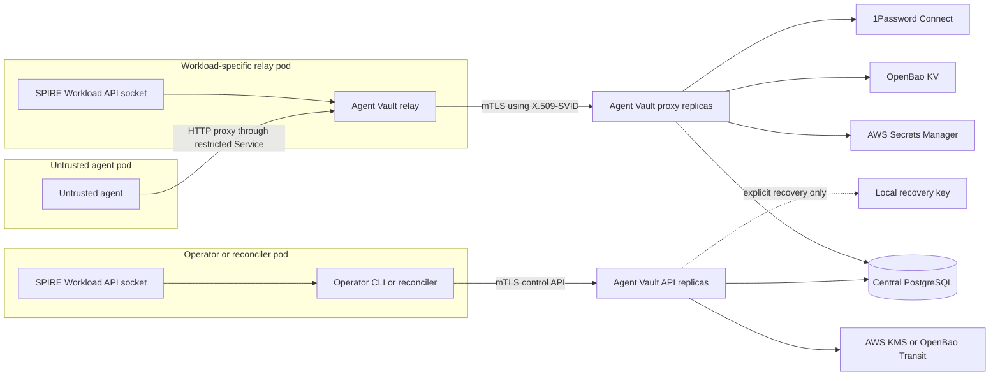

# Fleet deployment with Kubernetes, SPIFFE, and declarative configuration

Status: proposed

## Context

The Stigen fork targets Kubernetes clusters that already run SPIRE. A fleet of
workloads should use Agent Vault without email/password accounts or durable
agent tokens. Operators also run the CLI inside Kubernetes. Runtime settings
and desired Agent Vault state should be reproducible from TOML, state should be
shared through PostgreSQL, and credentials may come from AWS Secrets Manager,
OpenBao, 1Password Connect, or direct CLI imports.

The upstream code already provides a SQLite and PostgreSQL `Store` abstraction,
automatic PostgreSQL migrations protected by an advisory lock, database-backed
CA state, an encrypted credential cache, and multi-instance health checks. This
design extends those foundations rather than adding a second persistence path.

## Decisions

1. Workloads and the in-cluster operator CLI authenticate with rotating
   X.509-SVIDs obtained from the SPIRE Workload API.
2. A SPIFFE identity is represented by the existing `agent` actor type. The
   `agents` table gains a unique, nullable `spiffe_id`; existing grants, roles,
   audit records, rate limits, and proposal behavior remain applicable.
3. Agent processes use a workload-specific relay in a separate pod. Kubernetes
   network policy cannot isolate containers that share a pod network namespace,
   so the relay is reached through a ClusterIP Service. The relay alone receives
   the SPIRE Workload API socket and sends proxy traffic to Agent Vault over
   mTLS. Default-deny policies let the untrusted agent reach only its matching
   relay and prevent direct broker egress. No privileged firewall init container
   is required.
4. Runtime configuration and desired-state configuration are separate TOML
   documents. Runtime configuration is read locally at process startup. Desired
   state is reconciled through the authenticated HTTP API.
5. External secret sources are per credential, allowing providers to coexist
   in one vault. Both live references and one-time imports are supported.
6. The existing random DEK continues to encrypt credentials and cached secret
   material. AWS KMS or OpenBao Transit wraps the DEK. A separately configured
   local recovery recipient can also wrap it, but recovery is never automatic.
7. Shared PostgreSQL is the only production persistence topology. SQLite stays
   available for local development and migration input.
8. Legacy password/token authentication remains available as an upstream-
   compatible mode, but the fleet deployment uses `auth.mode = "spiffe"` and
   disables password registration, login, reset, and invitation endpoints.

## System architecture



## Runtime TOML

The default search path is explicit and predictable: `--config`, then
`AGENT_VAULT_CONFIG`, then `/etc/agent-vault/server.toml`. CLI flags override
environment variables, which override TOML, which overrides built-in defaults.
Unknown keys and conflicting settings are errors.

Secret values are forbidden in TOML. Sensitive settings use typed references
such as `env://DATABASE_URL` or `file:///var/run/secrets/...`. Error messages,
configuration inspection, and plan output redact reference resolutions.

Illustrative schema:

```toml
schema_version = 1

[server]
api_listen = ":14321"
proxy_listen = ":14322"
external_address = "https://agent-vault.agent-vault.svc"

[database]
url = "env://DATABASE_URL"

[auth]
mode = "spiffe"
workload_api = "unix:///run/spire/sockets/agent.sock"
trust_domains = ["spiffe://cluster.example"]
# Applied only when no owner actor exists.
bootstrap_owner_ids = [
  "spiffe://cluster.example/ns/agent-vault/sa/agent-vault-reconciler",
]

[encryption]
primary_wrapper = "aws-production"

[[encryption.wrappers]]
name = "aws-production"
kind = "aws-kms"

[encryption.wrappers.aws_kms]
key_arn = "arn:aws:kms:us-east-1:123456789012:key/uuid"
region = "us-east-1"

[[encryption.wrappers]]
name = "offline-local"
kind = "age-x25519"

[encryption.wrappers.age]
recipient = "age1..."
# The identity is supplied only to an explicit recovery command.

[[secret_providers]]
name = "aws-production"
kind = "aws-secrets-manager"
region = "us-east-1"

[[secret_providers]]
name = "bao-production"
kind = "openbao-kv-v2"
address = "https://openbao.example"
auth = "spiffe-x509"

[[secret_providers]]
name = "onepassword-production"
kind = "onepassword-connect"
address = "https://onepassword-connect.example"
token = "file:///var/run/secrets/onepassword/connect-token"
```

Provider credentials follow native workload mechanisms:

- AWS uses the SDK default provider chain, normally EKS Pod Identity or IRSA.
- OpenBao uses an X.509-SVID or audience-bound JWT-SVID.
- 1Password Connect requires its Connect token from a mounted Kubernetes
  Secret or CSI volume because Connect does not accept SPIFFE identities.

## Desired-state TOML and reconciliation

Desired-state files contain non-secret resource definitions. They are suitable
for version control and may be split by environment or team. An operator runs
`agent-vault config plan -f ...` and `agent-vault config apply -f ...` using its
SPIFFE identity.

```toml
schema_version = 1
manager = "platform-fleet"

[[vaults]]
name = "github-automation"

[[vaults.agents]]
name = "pr-reviewer"
spiffe_id = "spiffe://cluster.example/ns/agents/sa/pr-reviewer"
role = "proxy"

[[vaults.services]]
name = "github-api"
host = "api.github.com"
auth = { kind = "bearer", credential = "GITHUB_TOKEN" }

[[vaults.credentials]]
name = "GITHUB_TOKEN"
mode = "reference"
source = "aws-production"
ref = "arn:aws:secretsmanager:us-east-1:123456789012:secret:github#token"
refresh_interval = "5m"
max_staleness = "1h"
```

Apply behavior is server-side, idempotent, and ownership-aware:

- `plan` shows redacted creates and updates without resolving or displaying
  credential values.
- Apply uses optimistic revisions so concurrent operators cannot silently
  overwrite one another.
- The default is additive. `--prune` deletes only resources owned by the same
  manager, and destructive credential or identity pruning requires an
  additional explicit flag.
- Inline credential values, command substitution, and arbitrary executable
  secret resolvers are rejected.
- Imported values are resolved by the CLI and sent over mTLS without appearing
  in plans, logs, shell arguments, or stored desired-state metadata.

## SPIFFE authentication and transport

The API and remote proxy listeners obtain their server X.509-SVID from the
Workload API and rotate certificates without restarting. Client certificates
are validated against configured trust-domain bundles and exact SPIFFE IDs are
looked up in `agents.spiffe_id`. URI prefixes and wildcard identities are not
authorization rules.

The first configured bootstrap owner is created only when the database has no
owner actor. Subsequent changes happen through normal reconciled state. In
SPIFFE-only mode, absence of a valid peer SVID fails closed on protected API
routes and the proxy listener, and legacy bearer tokens and password routes are
unavailable. The API may accept a certificate-less TLS handshake for Kubernetes
health probes, but such a connection cannot pass authorization. Hybrid mode
enables optional-SVID TLS on the API while retaining the legacy plain proxy
listener until the fleet switches the proxy to SPIFFE-only.

The relay is the compatibility boundary for arbitrary agents:

1. Only the relay pod receives the Workload API socket.
2. The agent sees a workload-specific HTTP proxy Service and the existing MITM
   CA bundle. NetworkPolicy permits only the matching relay endpoint.
3. The relay establishes an outer mTLS connection to the central proxy and
   streams standard CONNECT or absolute-form proxy requests.
4. Agent Vault authorizes the peer SPIFFE ID, resolves its vault grant, and
   attributes request logs to the backing agent actor.

The in-cluster CLI can use mTLS directly and does not persist a login session.

## Secret provider model

A provider-neutral `SecretProvider` interface resolves a typed reference to a
value plus opaque provider version metadata. The server supports:

- AWS Secrets Manager, including JSON field selection and version pinning;
- OpenBao KV v2, with SPIFFE X.509 or JWT authentication;
- 1Password Connect, with vault/item/field selection;
- the current Infisical implementation through an adapter; and
- CLI-only `env`, `file`, and `stdin` resolvers for imports.

`reference` credentials refresh asynchronously with jitter and exponential
backoff. Successful values are encrypted under the DEK and cached in Postgres.
On provider failure, the last-known-good value may be used only until
`max_staleness`; after that, proxy use fails closed. Provider errors returned to
agents are generic, while operator-only health includes a sanitized diagnostic.

`import` credentials are resolved once by the CLI. They become ordinary local
credentials and do not retain a live source relationship. Imports never permit
secret literals in TOML.

Per-credential references replace the current vault-wide external-store
restriction. The existing Infisical vault configuration must be migrated or
adapted without losing cached values or dynamic-secret behavior.

## Envelope encryption and recovery

Credential values, OAuth material, provider caches, and the MITM CA private key
remain encrypted with a random 256-bit DEK. The database stores one or more
independent DEK wrappings with provider kind, key identifier, ciphertext, and
creation state.

- AWS KMS uses Encrypt/Decrypt with an encryption context containing the Agent
  Vault instance identifier.
- OpenBao Transit uses a named encryption key and stores the returned wrapped
  ciphertext.
- Local recovery encrypts the DEK to an age X25519 recipient. The private
  identity is kept offline or mounted only during a recovery operation.
- Startup uses only the configured primary wrapper. Recovery requires an
  explicit command or flag naming the recovery provider; there is no automatic
  failover or plaintext-DEK fallback.
- Rotation adds a verified new wrapping before retiring an old wrapping; bulk
  credential re-encryption is unnecessary.

Directly wrapping persistent data to workload SVID keys is intentionally
excluded. SVID keys rotate, replicas with the same SPIFFE ID may hold distinct
private keys, and expired keys are not a durable recovery mechanism. SVID keys
already protect transport through mTLS and authorize access to KMS/Transit.

## PostgreSQL and high availability

The existing PostgreSQL store remains authoritative. Fleet readiness work
includes:

- versioned migrations for SPIFFE IDs, credential source metadata, managed
  resource ownership, revisions, and multiple DEK wrappings;
- migration and bootstrap concurrency tests with multiple replicas;
- distinct liveness, readiness, and startup checks so pods do not accept
  traffic before migrations, SVID acquisition, DEK unwrap, and provider setup;
- TLS-required database connections, least-privilege database roles, bounded
  connection pools, and sanitized diagnostics;
- backup/restore verification that includes wrapped DEKs and recovery drills;
  and
- refresh-worker claiming or advisory locking so replicas do not duplicate all
  external-provider work.

## Rollout

1. Land typed runtime configuration without changing legacy defaults.
2. Add SPIFFE-backed agents and mTLS API/proxy listeners.
3. Add the isolated relay pod and prove SVID rotation end to end.
4. Add multiple DEK wrappers and perform a recovery drill.
5. Refactor secret stores to per-credential providers and add provider drivers.
6. Add desired-state plan/apply and CLI import workflows.
7. Deploy in hybrid authentication mode for migration, then switch the fleet
   deployment to SPIFFE-only mode and disable legacy credentials.

## Security acceptance boundaries

- No secret value or resolved provider credential is written to TOML, logs,
  plans, process arguments, audit metadata, or error responses.
- The untrusted agent container does not receive the SPIRE socket, SVID private
  key, provider token, KMS permission, or Agent Vault bearer token.
- Authorization matches exact SPIFFE IDs after cryptographic bundle validation.
- Loss of KMS/OpenBao availability does not silently activate local recovery.
- A stale external value is never used beyond its configured maximum age.
- A PostgreSQL-only compromise does not reveal credentials or a plaintext DEK.
